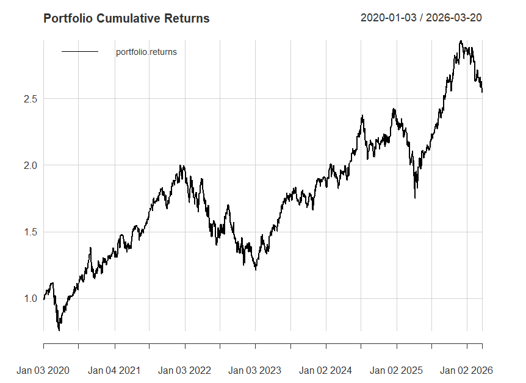
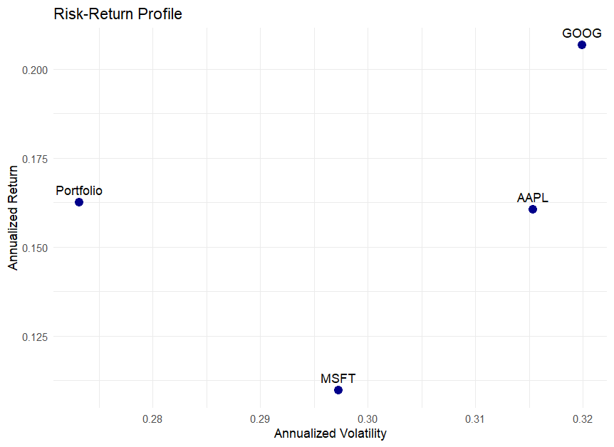
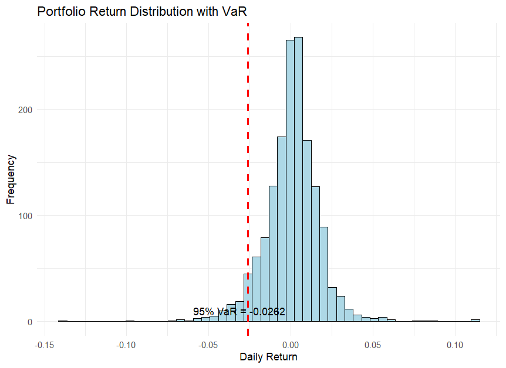

# Portfolio Risk & VaR Analysis (R)

## Overview
This project analyzes a three-asset portfolio (AAPL, MSFT, GOOG) using R. It downloads historical prices, computes key risk metrics, and visualizes the risk-return profile. The goal is to demonstrate skills in financial data analysis, risk measurement, and visualization.

## Data
- Source: Yahoo Finance via `quantmod`
- Period: 2020-01-01 to 2026-03-20
- Tickers: AAPL, MSFT, GOOG

## Methods
- **Returns**: Log returns from adjusted close prices.
- **Portfolio**: Equally weighted (1/3 each).
- **Risk Metrics**: Annualized return, annualized volatility, 95% VaR (historical simulation).

## Results
| Asset      | Annualized Return | Annualized Volatility |
|------------|------------------:|----------------------:|
| AAPL       |       16.05%      |        31.53%         |
| MSFT       |       10.97%      |        29.73%         |
| GOOG       |       20.67%      |        31.99%         |
| Portfolio  |       16.25%      |        27.31%         |

- **95% VaR (daily)**: -2.62%

- ## Visualizations

### Cumulative Returns

### Risk-Return Scatter

### Return Distribution with VaR

## How to Reproduce
1. Clone this repository.
2. Open `Portfolio_Risk.R` in RStudio.
3. Install required packages: `install.packages(c("quantmod", "PerformanceAnalytics", "ggplot2"))`
4. Run the script. Charts will appear and be saved to `outputs/` if you uncomment the saving code.

## Dependencies
- R (>= 4.0)
- Packages: quantmod, PerformanceAnalytics, ggplot2

## Future Work
- Add portfolio optimization (minimum variance, maximum Sharpe)
- Implement rolling VaR backtesting
- Convert to Python version
